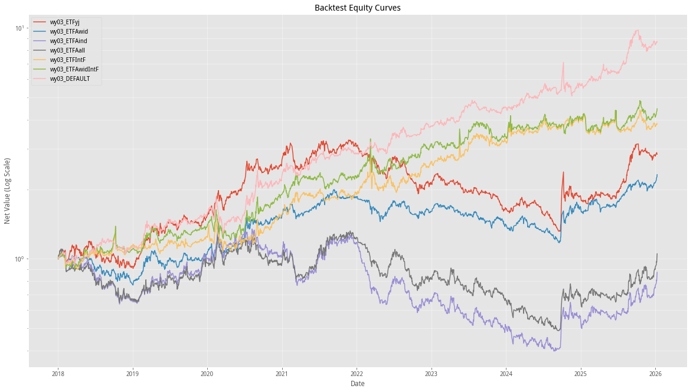

# ETF轮动策略研究(二)：标的池构建对策略绩效的决定性影响

## 引言

在第一篇报告中，我们验证了不同策略逻辑对收益和交易时间的敏感性。然而，一个更根本的问题往往被忽视：**策略的成功究竟源于优秀的择时逻辑，还是仅仅因为它“碰巧”坐在了最强的风口上？**

本篇报告将聚焦于**“ETF标的池 (Asset Pool)”**，探讨不同类型的资产组合（如纯A股、全球配置、行业轮动）如何从根本上决定动量策略的上限与下限。

## 零、调整ETF池

1.  `wy03`，原版
2.  `long`，长短期动量结合版
3.  `yj15`，综合择时版

上一篇文章我们比较了上面三个策略，第三个策略 `yj15` 选择的ETF池子不同于前两个。为了验证策略的普适性，我们进行了一项**压力测试**：将 `wy03` 和 `long` 策略的标的池统一替换为 `yj15` 所使用的池子（加上后缀 `_yj`），观察其表现变化。

| 指标 | wy03 | wy03_yj | long | long_yj | yj15 |
| :--- | :--- | :--- | :--- | :--- | :--- |
| 总收益 | 771.91% | 183.81% | 1074.89% | 337.12% | 1335.26% |
| 年化收益 | 32.06% | 14.33% | 37.21% | 20.85% | 40.78% |
| 波动率 | 25.31% | 29.16% | 24.07% | 27.04% | 20.03% |
| 最大回撤 | 30.66% | 59.77% | 27.62% | 52.28% | 31.65% |
| 最大回撤区间 | 2020-02-13 ~ 2020-03-17 | 2021-11-22 ~ 2024-09-23 | 2024-10-08 ~ 2024-11-18 | 2021-11-11 ~ 2024-09-23 | 2023-02-20 ~ 2024-09-04 |
| 夏普比率 | 1.11 | 0.35 | 1.38 | 0.62 | 1.84 |
| 索提诺比率 | 1.48 | 0.57 | 1.87 | 0.97 | 3.33 |
| 胜率 | 56.48% | 45.69% | 55.81% | 46.67% | 50.92% |
| 换手率 | 0.05 | 0.06 | 0.06 | 0.08 | 0.20 |

从上述对比中，我们可以观察到极具启发性的现象：

1. 收益能力的断崖式下跌
2. 风险彻底暴露，回撤显著增大（在50%以上），夏普比率大幅下降

仔细观察收益图，我们发现2021年底，替换过ETF池子的策略（wy03_yj, long_yj）收益拐头向下，直到2024年秋季才开始反弹，这与A股大盘的走势高度一致，再去看看两份ETF池子的构成：

|  | 替换后的 | 原版 |
| :--- | :--- | :--- |
| 国内大盘 | 沪深300 `510300` | 上证180 `510180` |
| 国内大盘2 | 上证50 `510050` | |
| 国内成长 | 创业板50 `159949` | 创业板 `159915` |
| 国内消费 | 消费 `159928` | |
| 商品黄金 |  | 黄金 `518880` |
| 海外美股 |  | 纳斯达克 `513100` |

显然，替换后的ETF池子中的资产都与A股高度相关，在大熊市中（2022-2024）中，策略无处可躲，只能硬扛或空仓，导致回撤巨大。

下面，我们使用 **wy03 (原版动量)** 作为测试策略，只改变ETF池子的构成，观察策略表现的变化。

## 一、测试方案设计

### 1.1 标的池构建

我们构建了以下几组具有代表性的标的池，旨在模拟不同投资者的风险偏好与资产视野：

| 标的池类型 | 包含指数/资产 | 对应ETF代码 | 备注 |
| :--- | :--- | :--- | :---|
| **基准池** | 黄金、纳指100、创业板指、上证180 | `518880`, `513100`, `159915`, `510180` | 全球大类资产 + 核心宽基 |
| **纯A股宽基池** | 沪深300、中证500、中证1000、国证2000 | `510300`, `510500`, `512100`, `159907` | A股市场大小盘轮动 |
| **行业赛道池** | 消费、半导体、证券、军工、医药、新能源 | `159928`, `512480`, `512880`, `512660`, `159929`, `516160` | 激进型行业轮动 |
| **全球指数池** | 标普500、纳指100、日经225、德国DAX | `513500`, `513100`, `513520`, `513030` | 全球宏观对冲 |
| **商品池** | 黄金、南方原油、豆粕 | `518880`, `501018`, `159985` | 商品对冲 |

测试时间段任然为2018年1月1日-2026年1月10日，策略参数与上文一致，选择每日的默认时间买卖。

### 1.2 评估方法论

为了更精确地衡量策略在不同标的池中的有效性，我们采用由宏观到微观的4层评估体系：

1.  **滚动收益对比**
    *   **方法**: 计算策略与池内所有ETF的 **N日滚动收益率**。
    *   **目的**: 观察策略的收益水平在池子中处于什么分位？是长期维持在前25% (Alpha)，还是随波逐流 (Beta)？

2.  **持仓周期归因**
    *   **方法**: 将回测分割为若干个“持仓不变阶段”。在每个阶段内，比较**策略持仓资产的收益**和**池内其他资产的收益**。我们用**命中率**表示策略选中的资产在该阶段表现最好的占比，而**胜率**则表示每个阶段内策略选中的资产收益超过池内所有资产收益均值的比例。
    *   **目的**: 能够直观判断每一次选择是否正确。例如：策略持有黄金的20天里，黄金是否真的是池子里表现最好的？如果策略选了黄金但纳指涨得更好，说明选股逻辑在当前池子中失效。

3.  **相对强弱曲线**
    *   **方法**: 绘制双图：上方显示 `策略净值 / 标的池等权指数` 的比值曲线；下方显示 `策略净值` 与 `标的池等权净值` 的绝对走势对比。
    *   **目的**: 曲线向上代表有持续Alpha，曲线走平代表只有Beta，曲线向下代表跑输平均。这是判断“主动管理是否创造价值”最直观的图表。

4.  **换仓效果分析**
    *   **方法**: 追踪每一次策略发生换仓操作后，在持有新资产的期间内，新旧资产的收益差。
    *   **目的**: 衡量“瞎折腾”还是“神操作”。如果大部分换仓后的 Alpha 为正，说明策略具备优秀的短线择时能力（卖飞的情况少，买对的情况多）。

## 二、回测绩效对比分析

### 2.1 数据汇总

1. 策略整体绩效概览

| 指标 | 基准 `wy03` | 对照 `wy03_yj` | A股宽基 `A_wid` | A股行业 `A_ind` | A股宽基+行业 `A_all` | 全球+商品 `IntF` | A股宽基+全球+商品 `AwidIntF` |
| :--- | :--- | :--- | :--- | :--- | :--- | :--- | :--- |
| **总收益** | **771.91%** | 183.81% | 131.39% | -12.54% | 5.15% | 284.89% | 346.44% |
| **年化收益** | **32.06%** | 14.33% | 11.37% | -1.71% | 0.65% | 18.89% | 21.18% |
| 波动率 | 25.31% | 29.16% | 21.98% | 33.09% | 32.21% | 27.69% | 28.62% |
| **最大回撤** | **30.66%** | 59.77% | 41.18% | 72.38% | 63.77% | 31.07% | 29.95% |
| 最大回撤区间 | 2020-02-13~2020-03-17 | 2021-11-22~2024-09-23 | 2021-09-13~2024-09-18 | 2020-02-25~2024-08-22 | 2020-02-25~2024-09-12 | 2022-03-09~2022-07-14 | 2022-03-09~2022-05-11 |
| 夏普比率 | **1.11** | 0.35 | 0.34 | -0.17 | -0.10 | 0.54 | 0.60 |
| 索提诺比率 | 1.48 | 0.57 | 0.47 | -0.27 | -0.16 | 0.68 | 0.76 |
| 胜率 | 56.48% | 45.69% | 47.01% | 41.04% | 43.39% | 58.39% | 52.11% |
| 换手率 | 0.05 | 0.06 | 0.06 | 0.09 | 0.09 | 0.08 | 0.10 |
| 盈亏比 | 0.44 | -0.19 | -0.34 | -0.60 | -0.55 | -0.05 | 0.02 |
| 平均持仓天数 | 487 | 487 | 487 | 325 | 195 | 278 | 177 |

2. 策略深度归因分析

| 指标 | 基准 | 对照(`yj`) | 国内宽基 | 行业赛道 | A股宽基+行业 | 全球+商品 | A股+全球+商品 |
| :--- | :--- | :--- | :--- | :--- | :--- | :--- | :--- |
| ETF池品种数 | 4 | 4 | 4 | 6 | 10 | 7 | 11 |
| **滚动收益 (N=20日)** | | | | | | | |
| 平均排名百分位 | 35.03% | 39.72% | 37.13% | 46.85% | 49.30% | 41.80% | 41.66% |
| 前25%时间占比 | 48.33% | 44.43% | 46.38% | 25.48% | 29.53% | 43.04% | 42.37% |
| 后25%时间占比 | 13.15% | 21.52% | 19.57% | 19.21% | 27.94% | 23.83% | 23.57% |
| **持仓归因分析** | | | | | | | |
| 总持仓段数 | 109 | 117 | 126 | 174 | 189 | 163 | 190 |
| 命中率 (按段数) | 30.28% | 29.06% | 23.81% | 14.94% | 12.70% | 11.04% | 11.05% |
| 命中率 (按天数) | 56.65% | 52.49% | 44.58% | 27.79% | 25.06% | 23.78% | 23.01% |
| 胜率 (按段数) | 49.54% | 43.59% | 52.38% | 43.68% | 46.03% | 50.31% | 46.84% |
| 胜率 (按天数) | 71.75% | 62.66% | 65.90% | 54.70% | 53.83% | 64.15% | 62.20% |
| 平均超额收益 | 1.14% | 0.64% | 0.34% | -0.24% | -0.12% | 0.33% | 0.46% |
| **几何累积收益** | | | | | | | |
| 策略收益 | 771.91% | 183.81% | 131.39% | -12.54% | 5.15% | 284.89% | 346.44% |
| 基准收益* | 186.46% | 61.98% | 49.02% | 66.39% | 60.65% | 153.83% | 118.39% |
| 实际超额 | 585.45% | 121.83% | 82.37% | -78.93% | -55.50% | 131.06% | 228.05% |
| **换仓效果 (含T日)** | | | | | | | |
| 成功率 (新>旧) | 55.56% | 45.69% | 54.40% | 45.09% | 45.21% | 48.77% | 54.50% |
| 平均Alpha | 2.28% | 1.73% | 0.55% | 0.61% | 0.40% | 0.42% | 0.53% |
| 累计Alpha | 246.76% | 201.06% | 69.29% | 105.73% | 74.75% | 67.93% | 100.61% |
| **换仓效果 (T+1日)** | | | | | | | |
| 成功率 (新>旧) | 55.56% | 39.66% | 49.60% | 39.88% | 40.43% | 51.23% | 52.38% |
| 平均Alpha | 1.95% | 1.24% | 0.43% | -0.16% | -0.34% | 0.34% | 0.20% |
| 累计Alpha | 210.99% | 143.38% | 53.60% | -27.81% | -64.03% | 55.20% | 37.36% |

* 基准收益：等权持有ETF池中的所有品种，每日再平均，且不考虑交易成本得到的收益。

### 2.2 核心发现

* 策略整体表现
    * 在大部分ETF池中，策略的收益均超过了等权持有策略，说明动量因子在多数大类资产中依然有效。
    * 从按段数计算的命中率和胜率来看，策略的择时成功率并不突出，意味着单纯看**每一次换仓决定，其准确率与掷硬币无异**。
    * 但从按天数计算的胜率来看，数据显著提升，基准策略甚至超过了70\%。这表明策略虽然不能保证每次买对，却能保证买对的时候拿得足够久，买错的时候跑得足够快。
    * 这说明，本策略是典型的趋势追踪策略，其盈利核心不在于高胜率，而在于盈亏比，即通过截断亏损和让利润奔跑来获取长期复利。
* 行业赛道池效益低下的原因
    * 加入行业赛道后策略效益急剧下降，主要源于A股行业板块呈现出的高波动与快速轮动特征。
    * 行业主题往往受短期资金情绪影响，行情虽爆发力强但持续性差，常常呈现尖峰形态。基于二十五日动量的策略具有天然滞后性，容易在板块大涨后追高买入，又在板块快速退潮后低位止损。
    * 这种追涨杀跌的行为在缺乏长趋势的震荡市中会不断磨损净值。此外，行业板块之间往往存在较高的相关性，当市场系统性风险来临，策略无法通过切换标的来规避下跌。
* 基准池表现卓越的原因
    * 从持仓统计数据来看，纳指+黄金两者合计持仓天数占比达65.8%，这意味着策略近三分之二的时间都在持有这两只长牛资产。
    * 策略有一半以上的时间持有池内排名第一资产，高于全球+商品池持有排名前两位资产的时间占比，说明基准池的资产差异化明显，容易选出强者。这归功于池内资产的低相关性，总有一个处于明显的上升趋势。
    * 综上，策略成功的根本原因是把纳指和黄金放进了池子，而非策略本身有多聪明。策略的作用仅仅是在合适的时候切换到这两只长牛资产上，并在它们回调时暂时躲避。
    * 这样，原策略就要求池子里的资产必须具有“一旦涨起来，就能持续很久”的特性。这是因为动量策略是迟钝的，它需要时间来确认趋势。如果一个ETF经常“涨三天跌两天”（如A股大部分行业板块），策略刚发出买入信号，行情就结束了，导致左右挨打。
    * 还有，池子里的资产最好彼此是低相关性甚至负相关性的，引入跨市场、跨品种的资产。